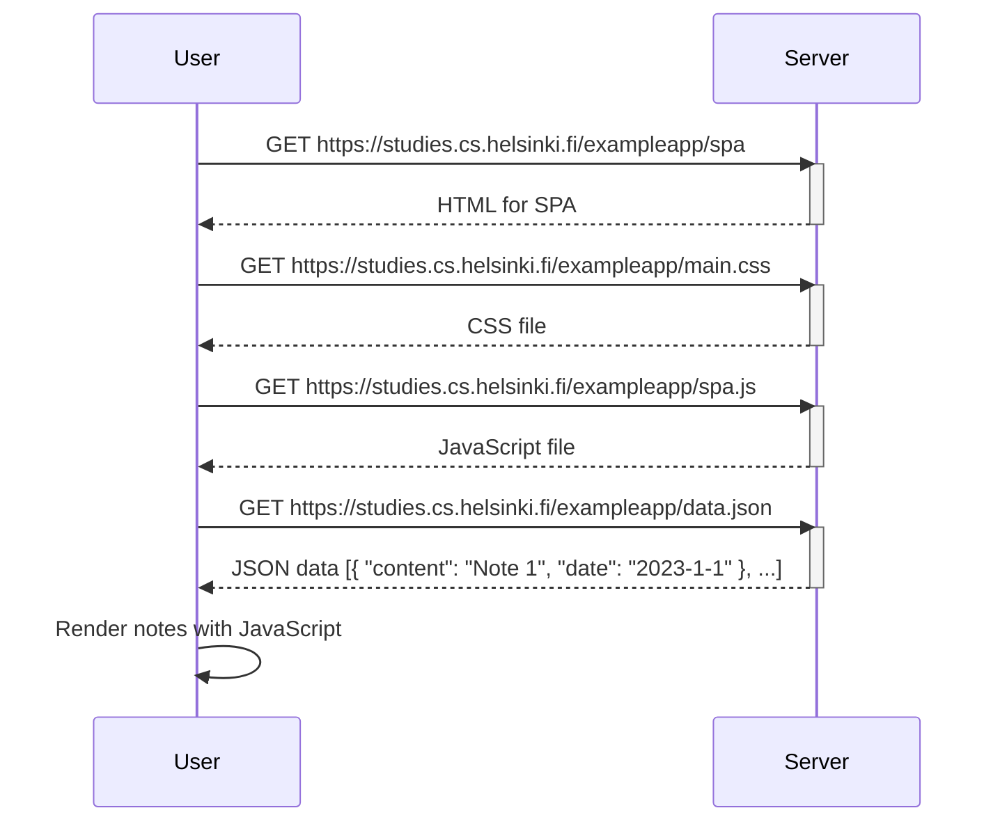

```mermaid

sequenceDiagram
    participant User
    participant Server

    User->>Server: GET https://studies.cs.helsinki.fi/exampleapp/spa
    activate Server
    Server-->>User: HTML for SPA
    deactivate Server

    User->>Server: GET https://studies.cs.helsinki.fi/exampleapp/main.css
    activate Server
    Server-->>User: CSS file
    deactivate Server

    User->>Server: GET https://studies.cs.helsinki.fi/exampleapp/spa.js
    activate Server
    Server-->>User: JavaScript file
    deactivate Server

    User->>Server: GET https://studies.cs.helsinki.fi/exampleapp/data.json
    activate Server
    Server-->>User: JSON data [{ "content": "Note 1", "date": "2023-1-1" }, ...]
    deactivate Server

    User->>User: Render notes with JavaScript
```
