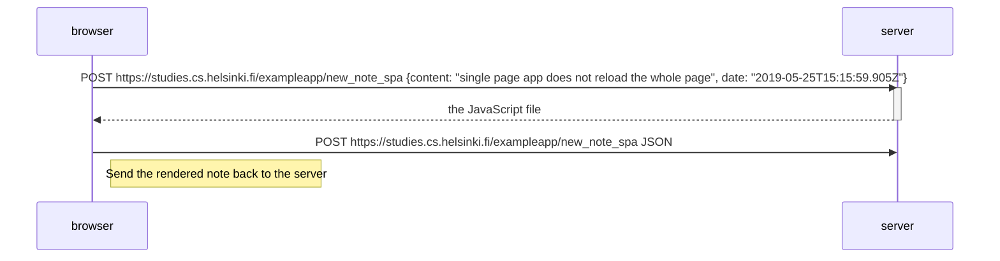

```mermaid

sequenceDiagram
    participant browser
    participant server

    browser->>server: POST https://studies.cs.helsinki.fi/exampleapp/new_note_spa   {content: "single page app does not reload the whole page", date: "2019-05-25T15:15:59.905Z"}
    activate server
    server-->>browser: the JavaScript file
    deactivate server

    browser->>server: POST https://studies.cs.helsinki.fi/exampleapp/new_note_spa JSON 

    Note right of browser: Send the rendered note back to the server

```
